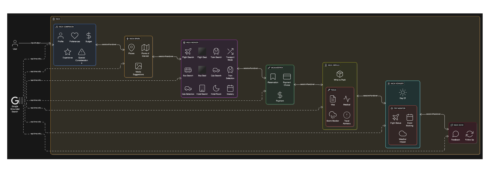
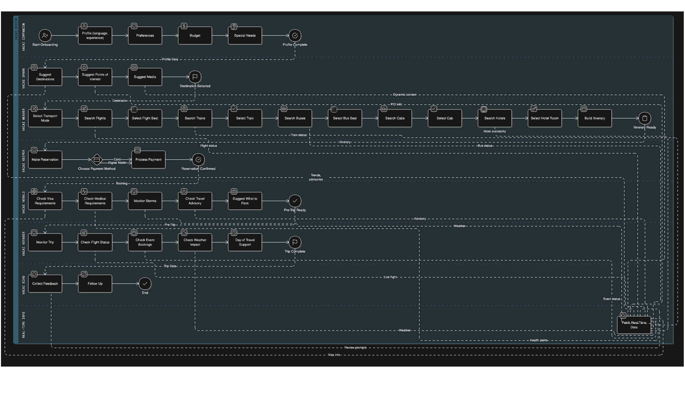

# vacAI Itinerary Planner for Gen AI Exchange Hackathon

## Problem Statement

### Personalized Trip Planner with AI

Develop an AI-powered personalized trip planner that dynamically creates end-to-end itineraries tailored to individual budgets, interests, and real-time conditions with seamless booking capabilities.

### Challenge

Travelers often struggle to create itineraries that balance budget, time, and personal interests. Existing tools provide generic suggestions, but they rarely adapt to individual preferences like cultural heritage, nightlife, or adventure. This leaves users spending hours piecing together trips from scattered sources, often missing hidden gems or overspending.

### Objective

Build an AI-powered trip planner that generates personalized, end-to-end itineraries tailored to a traveler’s budget, interests, and available time. The solution should simplify trip planning and deliver adaptive recommendations in real-time. Once finalized, the traveler should get the final itinerary and the system should also book it through EMT inventory in just a click of a button and accept payment.

## Solution Overview

**vacAI** is an innovative, modular, multi-agent system designed to streamline and personalize the entire travel lifecycle. With specialized agents dedicated to specific tasks, **vacAI** ensures a seamless and efficient travel experience.

### Key Capabilities:

- Generate dynamic itineraries that adapt to user inputs on budget, trip duration, and themes (e.g., heritage, nightlife, adventure).
- Aggregate data from multiple sources (maps, events, local guides) to recommend accommodation, transport, and experiences.
- Provide multilingual, interactive interfaces for personalized travel assistance across regions in India.
- Offer smart adjustments in real-time (e.g., weather changes, delays, or last-minute bookings).
- Deliver a shareable, optimized itinerary with cost breakdowns and allow booking with a click of a button.

### Core Modules and Agents

The traveler’s experience is divided into two stages: **Pre-booking** and **Post-booking**. Below are the key multi-agents utilized:

1. **vacAI Companion (User Agent)**  
   - Tailors the experience to the traveler’s unique preferences and needs.  
   - Sub-agents:
     - `user_profile_agent`: Stores language and demographic data.
     - `user_preference_agent`: Captures travel styles, preferences, and interests.
     - `user_budget_agent`: Helps manage financial constraints.
     - `user_experience_agent`: Tracks past trips to improve recommendations.
     - `user_special_consideration_agent`: Addresses special needs like accessibility or dietary restrictions.

2. **vacAI Spark (Inspiration Agent)**  
   - Ignites the travel journey with destination suggestions and exciting possibilities.  
   - Sub-agents:
     - `places_agent`: Suggests destinations based on user preferences.
     - `point_of_interest_agent`: Recommends attractions and experiences.
     - `media_suggestion_agent`: Suggests visual content for inspiration.

3. **vacAI Weaver (Planning Agent)**  
   - Builds a comprehensive itinerary based on user preferences and inputs.  
   - Sub-agents:
     - `transport_mode_selection_agent`: Suggests best transport modes (flight, train, bus, etc.).
     - `flight/train/bus/cab search_agents`: Simplifies booking for transport.
     - `hotel_search_agent`: Recommends hotels and helps select rooms.
     - `itinerary_agent`: Compiles final travel details.

4. **vacAI Keeper (Booking Agent)**  
   - Handles reservations and payment processes.  
   - Sub-agents:
     - `reservation_agent`: Manages bookings for transport, accommodation, and experiences.
     - `payment_choice`: Offers multiple payment methods.
     - `payment_agent`: Handles secure transactions.

5. **vacAI Herald (Pre-Trip Agent)**  
   - Ensures travelers are fully prepared for the journey.  
   - Sub-agent:
     - `what_to_pack_agent`: Provides packing suggestions based on the destination and weather.

6. **vacAI Voyager (In-Trip Agent)**  
   - Offers real-time assistance during the trip.  
   - Sub-agent:
     - `trip_monitor_agent`: Tracks the trip and provides updates (e.g., flight delays).

7. **vacAI Echo (Post-Trip Agent)**  
   - Captures feedback and engages the traveler after the trip.  
   - Sub-agents:
     - `feedback_agent`: Collects feedback about the trip.
     - `follow_up_agent`: Offers re-engagement opportunities, loyalty rewards, and new suggestions.

## Features

- **Accommodation Preferences**: Adapt to various types of accommodations (e.g., luxury hotels, boutique properties).
- **Custom Seat Selection**: Ask users for seat preferences (e.g., aisle, window).
- **Real-time Adjustments**: Adjust itineraries dynamically based on real-time conditions (e.g., weather, delays).
- **Seamless Payment**: The entire process, from itinerary generation to booking, is done with a single click after accepting payment.

## License

This project is licensed under the MIT License - see the [LICENSE](LICENSE) file for details.

## References

This project is based on similar template provided under google adk samples repository.

### Architecture
VacAI Architecture

### User Flow
VacAI User Flow

